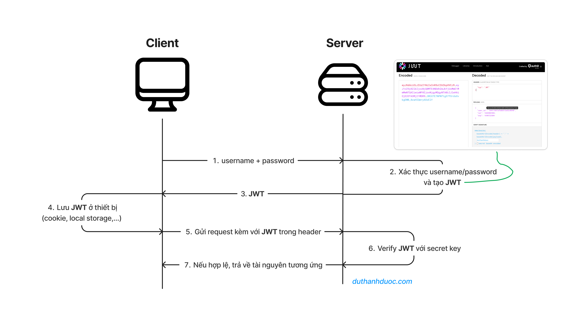

# User's input

## Client would send a request to the server with information, the information including these field

```
  name,
  email,
  password,
  confirm_password,
  date_of_birth
```

`const user_id = new ObjectId()` would create a new unique `_id` with **MongoDB-generated** identifier `ObjecetId()`

# We would have to understand what is signing JWT first

```
export const signToken = ({
  payload,
  privateKey,
  options = {
    algorithm: 'HS256'
  }
}: {
  payload: string | Buffer | object,
  privateKey: string,
  options?: jwt.SignOptions
}) => {
  return new Promise((resolve, reject) => {
    jwt.sign(payload, privateKey, options, (error, token) => {
      if(error) {
        throw reject(error)
      }
      resolve(token as string)
    })
  })
}
```

`JWT` include `HEADER` `PAYLOAD` `SIGNATURE`

### `HEADER`:

The **HEADER** contains metadata (data that provide information about one or more aspects of the data)

Example:

```
{
  "alg": "HS256",
  "typ": "JWT"
}
```

`"alg": "HS256"`. Means HMAC SHA-256 is used for signing.

`"typ": "JWT"`. Specifies that this is a JWT.

This come from

```
options = {
  algorithm: 'HS256'
}
```

### `PAYLOAD`:

The **PAYLOAD** contains the actual data (user-related information)

Example:

```
{
  "user_id": "65dcbf1e2f3b1234abcd5678",
  "token_type": "EmailVerifyToken",
  "verify": "Unverified"
}
```

`"user_id"`. The unique identifier for the user.

`"token_type"`. Identifies the purpose of the token.

`"verify"`. The verification status.

This come from:

```
payload = {
  user_id,
  token_type: TokenType.EmailVerifyToken,
  verify
}
```

### `SIGNATURE`:

The **SIGNATURE** is a cryptographic hash that ensures the token hasn't been modified

Generated using:

```
HMACSHA256(
  base64UrlEncode(header) + "." + base64UrlEncode(payload),
  privateKey
)
```

This come from:

`privateKey: process.env.JWT_SECRET_EMAIL_VERIFY_TOKEN as string`

## Full JWT Example:

```
HEADER:
{
  "alg": "HS256",
  "typ": "JWT"
}

PAYLOAD:
{
  "user_id": "65dcbf1e2f3b1234abcd5678",
  "token_type": "EmailVerifyToken",
  "verify": "Unverified"
}

SIGNATURE:
{
  privateKey: process.env.JWT_SECRET_EMAIL_VERIFY_TOKEN as string
}
```

## Back to the function

```
const email_verify_token = await this.signEmailVerifyToken({
  user_id: user_id.toString(),
  verify: UserVerifyStatus.Unverified
})
```

In this case, the full JWT would have these information:

```
HEADER:
{
  alg: "HS256",
  typ: "JWT"
}

PAYLOAD:
{
  user_id: new ObjectId(),
  token_type: TokenType.EmailVerifyToken,
  verify: Unverified
}

SIGNATURE:
{
  privateKey: process.env.JWT_SECRET_EMAIL_VERIFY_TOKEN as string
}

OPTIONS:
{
  expiresIn: process.env.EMAIL_VERIFY_TOKEN_EXPIRES_IN as any
}
```

This will create `email_verify_token`

```
await DatabaseService.user.insertOne(
    new User({
    ...payload,
    _id: user_id,
    username: `user${user_id.toString()}`,
    email_verify_token,
    date_of_birth: new Date(payload.date_of_birth),
    password: hashPassword(payload.password)
  })
)
```

## The database method would be used

```
await DatabaseService.user.insertOne(
  new User({
    ...payload,
    _id: user_id,
    username: `user${user_id.toString()}`,
    email_verify_token,
    date_of_birth: new Date(payload.date_of_birth),
    password: hashPassword(payload.password)
  })
)
```

These fields would be included in the `user` collection.

# We would have to understand what is access token and refresh token first

## I have not done anything with cookie yet, so no cookie document

## Problem

Every request client send to server have to include `session id` to authorize which is this `user`, do they have permision to access server's resource? This `session id` would be stored server's database, each request would require one database's query. Thus, increase the request's time.

## Access Token

- With JWT, we would create a JWT with user's information (e.g. `user_id`) and send to user. The server would not have to store this JWT token. Each time user send a request to server, send this JWT token instead. Server would just have to verify this JWT token to know which user is this, which permision they have.
- This method of using token for authorization is called **Token Based Authentication**

## User authorization with access token flow



1. Client a request that would access protected resource to server. If client is `UNAUTHORIZE`, return `401_UNAUTHORIZE`. Client need to send **username and password** to server.

2. Server would verify authorization data to server's database. If authorize data exists, create a JWT including **payload(user_id, etc.)**. This JWT is `access token`.

3. Server would send `access token` to client.

4. Client store `access token` to **client-side storage (cookie, local storage, etc.)**.

5. With other next request, client's request would include `access token` in it's **HEADER**.

6. Server would verify `access token` with `secret key` to verify the token's validity.
7. If valid, give access to requested resource. On logout, remove the `access token` in client-side storage.

8. When `access token` is out-of-time, server would reject client's request, client would remove the `access token` in client-side storage and change to logged out stage.

## The problem with access token

- With the flow, `access token` is not stored on server but client. This is `stateless`, server is not storing any user's state.
- But this would be unable to retrieve `access token`.

**For example:**

Example 1: On server, it is unable to **dynamically logging out a user** as there is no option to remove `access token` on client side

Example 2: Client got hacked, hacker can access resources with stolen `access token`. Even the with the server acknowledgement, the server can not reject that `access token`, as we can only check the `access token` validation but not `access token's blacklist`.

With example 2, we can set short `access token's expire time`, in most of the cases, 5 minutes. Even with the stolen `access token`, there's only a short window of time the `access token` is available. Which reduce the risk.

But this solution come with a drawback. Client would have to re-login every 5 minutes, which is inconvenience.

Instead, we would use another JWT token called `refresh token`.

## What is refresh token?

`refresh token` is created in the same time with `access token`. `refresh token` have a much loger `refresh token's time expire` (e.g 1 week, 1 month, etc)

## Authorization with `access token` and `refresh token` flow would look like this

1. The client sends a request to a server resource that requires validation. If the client is unverified, server would return `401 Authorization`.

2. The client sends `username and password` to server. Server would verify submitted `username and password` with `User collection` in database. If verified, server would create **2 different JWT** (`access token` and `refresh token`) that contains `payload` which include `user_id` (or similar property). `access token` with short expire time (e.g 5 minutes) and `refresh token` with long expire time (e.g 1 year). `refresh token` would be stored in database while `access token` would not.

3. Server return `access token` and `refresh token` to client.

4. Client stores `access token` and `refresh token` in client-side's storage (e.g cookie, local storage, etc.).

5. Client's requests would include `access token` in **HEADER**.

6. Server verify `access token` with **secret key** for validation.

7. If verified, server give permission for requested reources.

8. When `access token` is exprired, client send `refresh token` to the server for new `access token`.

9. Server validating `refresh token`, checking if the `refresh token` exists in database. If validated, server would **delete old `refresh token`** and **create new `refresh token` with the same expire date** (e.g. old `refresh token` expire in 5/10/2023, new `refresh token` also expire in 5/10/2023) stored in database, create new `access token`.

10. Server return **new `access token`** and **new `refresh token`** to client.

11. Client stores **new `access token`** and **new `refresh token`** in client-side storage (cookie, local storage, etc.)

12. Client's request function can be done with **new `access token`** (`refresh token`'s process happens in the background, so the client would not be logged out).

13. Client's logout request can be done with logout API, server would delete `refresh token` in database, as well as removing **`access token` and `refresh token`** on client-side's storage.

14. When `refresh token` expires (or invalid), server would reject client's request, client would delete **`access token` and `refresh token`** in client-side's storage and change to logged out status.

## The discrepancy between theory and practice:

- Authorization with JWT is exptected to be `stateless`, but we clearly stores `refresh token` in databse, this lead to storing client's status on server, which make this `stateful `.

- We can't always use `stateless`, combining `stateless` and `stateful` to add more security. `access token` is `stateless` and `refresh token` is `stateful`.

- Existing discrepancy between theory and real life practice, challenging to implement completely `stateless` for JWT.

- Store `refresh token` in database as its expire time is long. In case client's `refresh token` was leaked, server can delete that user's `refresh token`, increase overall security.

- Logout a client would be done by deleting client's `refresh token` in database. After the client's `access token` expires, sending `refresh token` is invalid and client would be logged out. But this method is not instant as `access token` has an expiration time.

- We can improve by reducing `access token`'s expiration time and use `websocket` to notify client for immediate logout.

## Frequent asked question about JWT

### Why create a new `refresh token` when we send `refresh token` to server

- If the `refresh token` was leaked, hacker can use it to get **new `access token`**, this is unwanted. Thus, `refresh token` has long expiration time but whenever `access token` expires, the server have to **create a new `refresh token`** and **delete old `refresh token`**

- Note: **New `refresh token`** and **Old `refresh token`** have the same expire date\*\* (e.g. old `refresh token` expire in 5/10/2023, new `refresh token` also expire in 5/10/2023)

- This method is called **refresh token rotation**.

### How to revoke an access token

- `access token` is stateless, there's no option to revoke it instantly but through `websocket` and revoking `refresh token`.

- The server could stores `access token` in database for instant revok. However, doing this method leads to `stateful access token`.

### Identical JWT?

- In a JWT (JSON Web Token), the payload typically includes an iat (issued at) field, which records the timestamp of when the token was created. This field is measured in seconds and is included by default unless explicitly disabled.

- As a result, if two JWTs are generated within the same second and the payload remains identical, the tokens will be identical as well.

### Where Should Access Tokens and Refresh Tokens Be Stored on the Client?

- In a web environment, JWTs can be stored in either cookies or local storage, each with its own advantages and disadvantages. However, cookies offer a slight security advantage over local storage.

- A detailed comparison between local storage and cookies (haven't learn yet).

- For mobile applications, JWTs are typically stored in the device's secure storage.

### How to Send an Access Token to the Server?

**There Are Two Cases:**

- **Stored in Cookies:** If the access token is stored in cookies, it will be automatically sent with each request to the server. No additional action is needed.

- **Stored in Local Storage:** If stored in local storage, manually add it to the request headers with the key Authorization and the value `Bearer <access_token>`.

### Why Bearer before access token?

- Whether you need to add "Bearer" before the access token depends on how the backend server is implemented.

- To follow proper API authentication standards, the server should require the client to prepend "Bearer " to the access token. This specifies that the authentication method being used is Bearer Authentication (token-based authentication).

**What is Bearer Authentication?**

The term "Bearer" comes from the word "bearer," meaning "someone who carries something." In this context, anyone who possesses the token is granted access to the requested resources. This is different from other authentication methods like:

- Basic Authentication (which requires a username and password)

- Digest Authentication (which involves hashed credentials)

**Why Add "Bearer" Before the Access Token?**

- Defines the Authentication Type:

  - It informs the server about the authentication method being used, allowing it to handle requests correctly.

- Standardization:

  - Using the "Bearer" prefix ensures that applications and servers follow authentication best practices and industry standards.

- Clear Distinction Between Authentication Methods:
  - If the server supports multiple authentication methods, the "Bearer" prefix helps distinguish token-based authentication from other types.

Thus, properly formatting the request header as follows ensures seamless authentication:

`Authorization: Bearer <access_token>`

## Logging out, only need to delete the access token and refresh token from the client's storage?

- If you simply delete the access token and refresh token from the client’s storage without calling the logout API, you will still be logged out. However, this approach is not secure. The refresh token will still exist in the database, and if a hacker gains access to your refresh token, they can still generate a new access token.

- For better security, it is recommended to call the logout API, which should invalidate the refresh token on the server side, ensuring that it can no longer be used to obtain new access tokens.